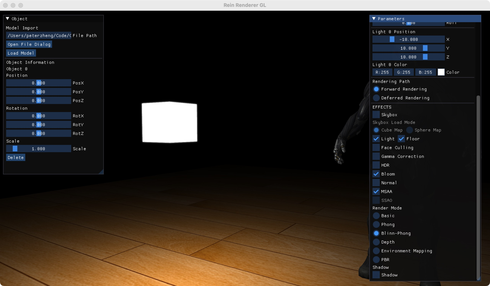

# Rain Renderer

This renderer is written in C++ based on OpenGL, which is used for my own Computer Graphic's study.

- C++
- OpenGL
- Rasterization
- GPU

## Example Images

*PBR*


*Phong*


*Blinn-Phong*


*Environment Mapping*


*depth testing*


*Shadow Mapping*


*SSAO*


*bloom*



*Demo Video*


## Features

- Forward Rendering
  - MSAA
  - Depth testing
  - Shadow mapping
  - Phong reflection model
  - Blinn–Phong reflection model
  - Environment mapping
  - Physically based rendering (PBR)
  - Image-based lighting (IBL)
- Deferred Rendering
  - Blinn–Phong reflection model
  - SSAO
- Cube-mapped skybox and sphere-mapped skybox
- Tangent space normal mapping
- Back-face culling
- Orbital camera controls
- Object controls
- Gamma correction
- HDR
- Bloom

## Load Models

This part is supported by `imgui` and `tinyfiledialogs`. 

- If you directly press the `Load Model` button, the renderer will load the a default miku model.
- Load your own models:
  1. put your model file `./obj` , `./fbx`, `.dae`, or `./pmx` in the directory `resources/objects` .
  2. Press `Open File Dialog` button and find your own model file.
  3. Press the `Load Model` button, the renderer will load the your desired model.

## Major Classes

- `Renderer` : It is a major class for rendering part, including all the shared shaders and frame buffers.
- `Shader` : It is a class for compiling the shaders for our renderer, including the functions to set the shader.
- `FrameBuffer` : It is a class for establishing frame buffers , including sub-color textures, sub-depth texture, sub-render buffer objects.
- `Object` : It is a class for creating all the objects in the renderer, including the models (meshes) and their position.
- `Texture` : It is a class for creating all the kinds of textures in our renderer.
- `Skybox` : It is a class for creating skybox and IBL part.
- `Scene` : It is a class for managing the major contents in our renderer, such as objects, floor, skybox, lights, camera, etc.

## Third Party Libraries

- `assimp` https://github.com/assimp/assimp
- `glfw` https://github.com/glfw/glfw
- `glm` https://github.com/g-truc/glm
- `imgui` https://github.com/ocornut/imgui
- `stb_image` https://github.com/nothings/stb
- `tinyfiledialogs` [native-toolkit/libtinyfiledialogs (github.com)](https://github.com/native-toolkit/libtinyfiledialogs?tab=readme-ov-file)

## Windows building
All relevant libraries are found in /libs and all DLLs found in /dlls (pre-)compiled for Windows. 
The CMake script knows where to find the libraries so just run CMake script and generate project of choice.

Keep in mind the supplied libraries were generated with a specific compiler version which may or may not work on your system (generating a large batch of link errors). In that case it's advised to build the libraries yourself from the source.

## Linux building
First make sure you have CMake, Git, and GCC by typing as root (sudo) `apt-get install g++ cmake git` and then get the required packages:
Using root (sudo) and type `apt-get install libsoil-dev libglm-dev libassimp-dev libglew-dev libglfw3-dev libxinerama-dev libxcursor-dev  libxi-dev libfreetype-dev libgl1-mesa-dev xorg-dev` .

**Build through CMake-gui:** The source directory is LearnOpenGL and specify the build directory as LearnOpenGL/build. Creating the build directory within LearnOpenGL is important for linking to the resource files (it also will be ignored by Git). Hit configure and specify your compiler files (Unix Makefiles are recommended), resolve any missing directories or libraries, and then hit generate. Navigate to the build directory (`cd LearnOpenGL/build`) and type `make` in the terminal. This should generate the executables in the respective chapter folders.

**Build through Cmake command line:**
```
cd /path/to/LearnOpenGL
mkdir build && cd build
cmake ..
cmake --build .
```

Note that CodeBlocks or other IDEs may have issues running the programs due to problems finding the shader and resource files, however it should still be able to generate the executables. To work around this problem it is possible to set an environment variable to tell the tutorials where the resource files can be found. The environment variable is named LOGL_ROOT_PATH and may be set to the path to the root of the LearnOpenGL directory tree. For example:

    `export LOGL_ROOT_PATH=/home/user/tutorials/LearnOpenGL`

Running `ls $LOGL_ROOT_PATH` should list, among other things, this README file and the resources directory.

## Mac OS X building
Building on Mac OS X is fairly simple:
```
brew install cmake assimp glm glfw freetype
cmake -S . -B build
cmake --build build -j$(sysctl -n hw.logicalcpu)
```
## Create Xcode project on Mac platform
Thanks [@caochao](https://github.com/caochao):
After cloning the repo, go to the root path of the repo, and run the command below:
```
mkdir xcode
cd xcode
cmake -G Xcode ..
```

## Reference

Special thanks to Learn OpenGL [https://learnopengl.com](https://learnopengl.com) for their invaluable tutorials and assistance.
